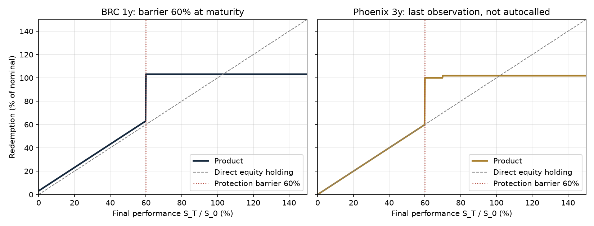
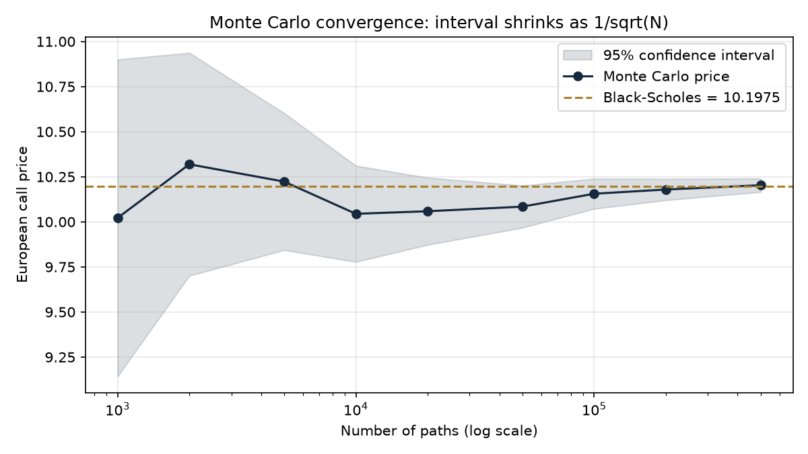
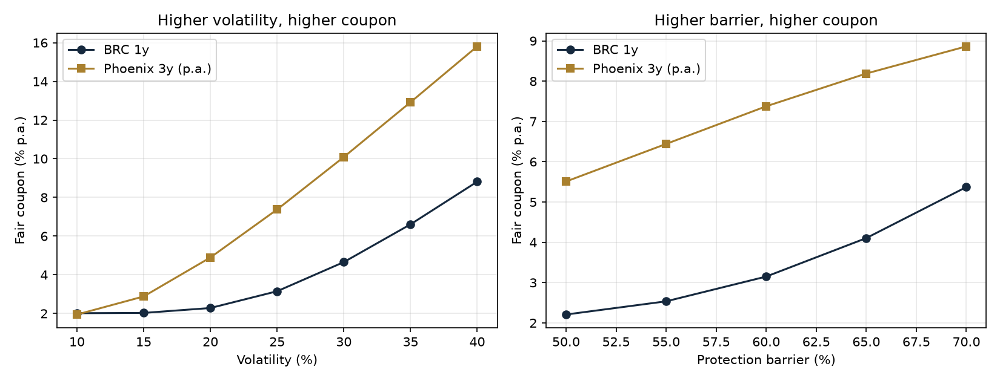
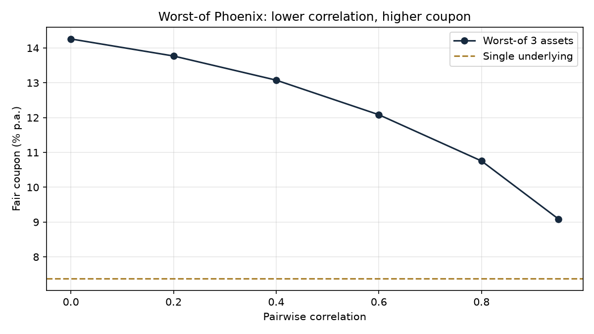

# Structured Products Pricer

Monte Carlo pricer for two flagship equity structured products: a **Barrier Reverse Convertible (BRC)** and a **Phoenix autocall with memory coupon**, on a single underlying and as a **worst-of** on a correlated basket. The pricer solves for the **fair coupon** an issuer can offer after its margin, computes **Greeks** by bump-and-revalue, and maps how the coupon reacts to volatility, correlation and barrier level.

Every Monte Carlo engine is validated against closed-form prices (Black-Scholes, Reiner-Rubinstein) before being used on path-dependent payoffs.



---

## 1. Overview

A structurer's daily question is: *given today's market and the bank's margin, what coupon can we pay the client, and why does it move when the market moves?* This repository answers it for a BRC and a Phoenix autocall, with a fully vectorised NumPy Monte Carlo engine and a numerical coupon solver.

**Key results** (S0 = 100, r = 3%, q = 2%, σ = 25%, issuer margin 1%):

| Result | Value |
|---|---|
| European call, Monte Carlo vs Black-Scholes (200k antithetic paths) | 10.2309 vs 10.1975, **3.3 bp** of nominal, 1.1 standard errors |
| Continuous down-and-in put, daily simulation **with** Broadie-Glasserman-Kou correction | gap **1.1 bp** (0.3 SE) vs 13.5 bp (4.1 SE) without it |
| Fair coupon, BRC 1y, barrier 60% at maturity | **3.15% p.a.** (closed form), 3.13% ± 0.01% (Monte Carlo) |
| Fair coupon, BRC 1y, continuous barrier 60% | **3.95% p.a.** |
| Fair coupon, Phoenix 3y, quarterly, memory | **7.38% p.a.** (8.13% without memory) |
| Fair coupon, worst-of 3 Phoenix, correlation 0% → 95% | **14.26% → 9.09% p.a.** |

---

## 2. Products

### Barrier Reverse Convertible (1 year)

| Term | Value |
|---|---|
| Nominal | 100% |
| Coupon | Fixed, paid at maturity in all scenarios |
| Protection barrier | 60% of initial level, observed at maturity (European) or continuously (American) |
| Redemption | 100% if the barrier was not breached; otherwise 100% × min(S_T / S_0, 1) |

**Decomposition:** BRC = zero-coupon bond + coupon − down-and-in put (strike 100%, barrier 60%) sold by the investor.

```
Client pays 100  =  zero-coupon 97.04  +  coupon PV 3.06  +  issuer margin 1.00  -  put premium 1.10
```

### Phoenix autocall with memory (3 years, quarterly observations)

At each of the 12 observation dates, with W the performance of the underlying (or of the worst performer in the basket):

1. **Autocall** if W ≥ 100%: early redemption at 100% + coupon + missed coupons.
2. **Coupon** if W ≥ 70%: coupon paid, plus all previously missed coupons (memory effect).
3. Otherwise the coupon is stored in memory.
4. **At maturity**, if never autocalled: 100% if W ≥ 60%, otherwise 100% × W (capital loss).

The implementation is a vectorised state machine over the observation dates (`alive`, `missed`), with each cash flow discounted from its own payment date.

---

## 3. Methodology

**Model.** Geometric Brownian motion under the risk-neutral measure, with constant r, q and σ, simulated with the exact log-normal step:

$$S_{t+\Delta t} = S_t \exp\left[\left(r - q - \tfrac{1}{2}\sigma^2\right)\Delta t + \sigma\sqrt{\Delta t}\,Z\right]$$

Only the dates the payoff needs are simulated (one step for a European barrier, 12 for the Phoenix, 252 for continuous monitoring).

**Correlated basket.** Independent normals are correlated with the Cholesky factor of the correlation matrix (ρ = L Lᵀ, Z = ε Lᵀ). Output shape: `(n_paths, n_dates, n_assets)`; the worst performer is `perf.min(axis=2)`.

**Variance reduction.** Antithetic variates (Z, −Z). The standard error is computed on the pair averages, which are independent, giving an honest 95% confidence interval.

**Discrete vs continuous barrier.** A daily simulation misses intraday breaches and under-prices a knock-in. The Broadie-Glasserman-Kou correction shifts a down barrier to H · exp(+0.5826 σ √Δt) to recover the continuous price.

**Fair coupon.** `scipy.optimize.brentq` finds the coupon c such that price(c) = 100% − margin. Paths are generated once and reused for every trial coupon, so the price is a smooth, monotonic function of c.

**Greeks.** Central finite differences (bump and revalue) with **common random numbers**: the same seed is used for the up and down scenarios, so the simulation noise cancels in the difference. Delta and gamma with a 1% spot bump, vega per vol point, rho per basis point.

---

## 4. Validation

| Test | Reference | Monte Carlo | Gap |
|---|---|---|---|
| European call (200k paths) | Black-Scholes 10.1975 | 10.2309 ± 0.0305 | 3.3 bp, 1.1 SE |
| European put (200k paths) | Black-Scholes 9.2222 | 9.2324 ± 0.0174 | 1.0 bp, 0.6 SE |
| Down-and-in put, barrier at maturity (400k paths) | Closed form 1.1013 | 1.0851 ± 0.0107 | inside the 95% CI |
| Down-and-in put, continuous, daily, no correction (60k × 252) | Reiner-Rubinstein 1.8824 | 1.7474 ± 0.0328 | −13.5 bp, **−4.1 SE (bias)** |
| Same, with BGK correction | Reiner-Rubinstein 1.8824 | 1.8934 ± 0.0338 | 1.1 bp, 0.3 SE |
| Call Greeks, bump & revalue vs Black-Scholes | Δ 0.554, Γ 0.0154, vega 0.386 | Δ 0.554, Γ 0.0154, vega 0.385 | < 0.001 |

Convergence of the call price follows the expected 1/√N rate: the 95% CI width falls from 1.76 at 1,000 paths to 0.075 at 500,000.



All checks are automated in `tests/` (**33 pytest tests**), including Monte Carlo vs closed form, put-call parity, Phoenix edge cases (hand-computed memory example, autocall at the first date, loss below protection), worst-of checks (empirical correlation matches the target, each asset matches its forward, coupon falls with correlation) and Greeks vs Black-Scholes.

---

## 5. Results

### Fair coupon vs volatility and barrier level

| Volatility | 10% | 15% | 20% | 25% | 30% | 35% | 40% |
|---|---|---|---|---|---|---|---|
| BRC 1y | 2.02% | 2.03% | 2.28% | 3.15% | 4.66% | 6.61% | 8.82% |
| Phoenix 3y (p.a.) | 1.95% | 2.88% | 4.89% | 7.38% | 10.09% | 12.92% | 15.81% |

| Protection barrier | 50% | 55% | 60% | 65% | 70% |
|---|---|---|---|---|---|
| BRC 1y | 2.21% | 2.54% | 3.15% | 4.10% | 5.37% |
| Phoenix 3y (p.a.) | 5.51% | 6.44% | 7.38% | 8.19% | 8.86% |



**Reading.** At low volatility the put sold by the investor is worth almost nothing and the BRC coupon converges to its floor, 99 / 97.04 − 1 = **2.02%**: the risk-free rate minus the margin. Every basis point above that floor is financed by the put. A higher barrier makes the put easier to activate, so it is worth more and the coupon rises.

### Worst-of and correlation



The worst-of Phoenix on three underlyings pays **14.26% p.a. at 0% correlation** and **9.09% at 95%**, vs 7.38% for the single-asset version. The investor is **short correlation**: the less the stocks move together, the more likely one of them breaches a barrier, and the more the issuer pays for that risk.

### Greeks (per 100 nominal, investor's view)

| Product | Price | Delta | Gamma | Vega (per vol pt) | Rho (per bp) |
|---|---|---|---|---|---|
| BRC 1y, barrier 60% | 98.99 | 0.105 | −0.0074 | **−0.235** | −0.0089 |
| Phoenix 3y, memory | 98.99 | 0.197 | −0.0158 | **−0.435** | −0.0044 |

Both products are **short vega and short gamma** for the investor: the issuer is long volatility, which it hedges in the market. The Phoenix is more short vega than the BRC because the investor sells more optionality (the put, the autocall and the conditional coupons, over three years).

---

## 6. Limitations

- **Constant volatility.** No smile or skew. On equities, out-of-the-money puts trade at a higher implied volatility than at-the-money options, so this model **under-prices** the 60% put and therefore under-states the fair coupon. A local or stochastic volatility model (Dupire, Heston) would fix this.
- **GBM dynamics.** No jumps; crash risk below the barrier is under-represented.
- **Constant rates and continuous dividend yield.** No rate curve, no discrete dividends, no dividend risk.
- **No issuer credit risk.** The zero-coupon is discounted at the risk-free rate. In practice the issuer's funding spread increases the coupon it can pay.
- **Flat correlation.** One correlation for every pair, constant through time; correlation skew (correlation rising in sell-offs) is ignored.
- **Monte Carlo Greeks** of discontinuous payoffs (barrier, digital coupons) remain noisy close to the barriers, even with common random numbers.

---

## 7. How to run

```bash
git clone https://github.com/kevingautierr-dev/structured-products-pricer.git
cd structured-products-pricer
python -m venv .venv
# Windows: .venv\Scripts\activate    macOS / Linux: source .venv/bin/activate
pip install -r requirements.txt
pip install -e .

pytest                                   # 33 tests
python examples/vanilla_check.py         # MC vs Black-Scholes
python examples/barrier_continuous_check.py
python examples/brc_fair_coupon.py
python examples/phoenix_fair_coupon.py
python examples/worst_of_correlation.py
python examples/greeks_report.py
python examples/sensitivities.py
python examples/payoff_diagrams.py
```

### Code structure

```
src/pricer/
├── paths.py       # GBM simulation, Cholesky-correlated baskets, antithetic variates
├── products.py    # payoffs: vanillas, down-and-in put, BRC, Phoenix (state machine)
├── engine.py      # Monte Carlo estimate, standard error, 95% CI
├── analytics.py   # closed forms: Black-Scholes, down-and-in puts, BGK shift, BRC, BS Greeks
├── greeks.py      # bump & revalue with common random numbers
└── solver.py      # fair coupon with Brent's method
tests/             # 33 pytest tests, MC vs closed forms
examples/          # scripts reproducing every figure and table above
```

---

## 8. Next steps

- **Volatility smile:** local volatility (Dupire) or Heston, to price the skew into the put.
- **Control variate:** use the closed-form European put to reduce the variance of the BRC.
- **More products:** step-down autocall, capital-protected note, Twin-Win, and a generic termsheet-driven pricer (product described in a config file).
- **Issuer credit spread** in the discounting.
- **Pathwise / likelihood-ratio Greeks** for smoother sensitivities near the barrier.

---

*Author: Kevin Gautier. MSc in Finance (Corporate & Market Finance), International University of Monaco.*
